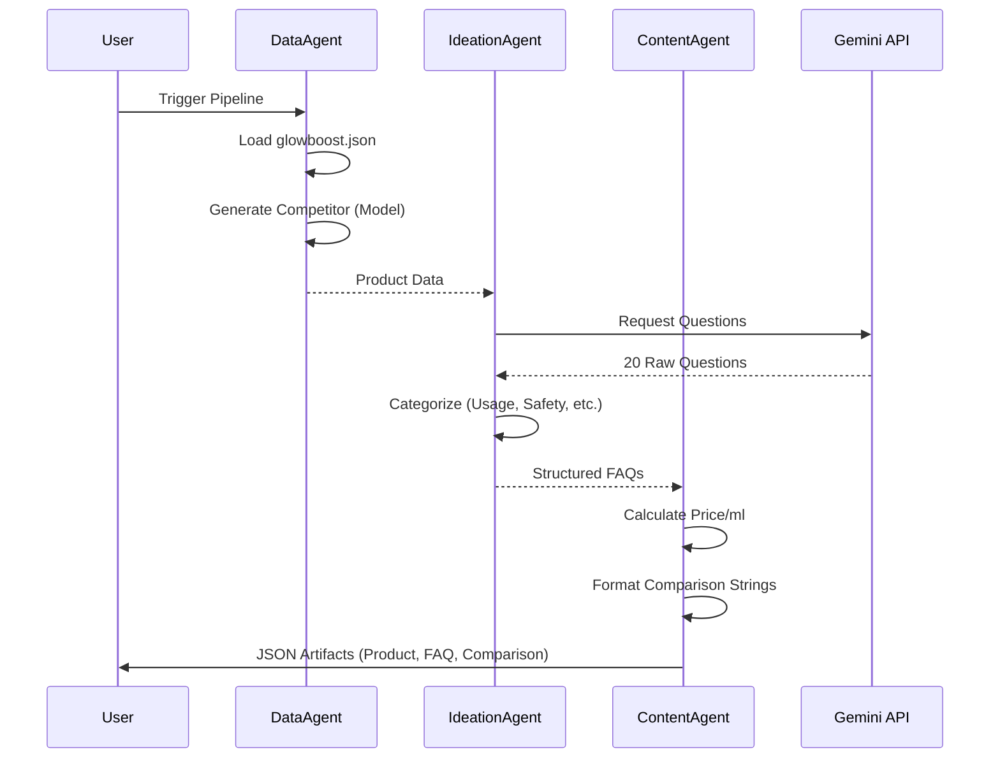

# Kasparro Content Generation Pipeline Documentation
<!-- Updated for v2.1 -->

## 1. System Architecture

This system uses a **Sequential Multi-Agent Architecture** to ensure data consistency and high-quality content generation. The pipeline uses "Data" as the source of truth, "Ideation" for creativity, and "Content" for structuring.



## 2. Design Decisions (The "Why")

### Why Sequential?
Content generation has strict dependencies. We cannot generate the *Comparison Page* until we have the *Competitor Data*. We cannot format *FAQs* until we have *Brainstormed Questions*. A dependency graph (Sequential) approach reduces race conditions and ensures data integrity.

### Why "Logic Blocks"?
We separate "Generative" logic (LLM) from "Deterministic" logic (Math). This ensures consistent pricing and ingredient analysis, which are critical for auditable content.

#### Code Example: Price Calculation
```python
def calculate_price_per_ml(price, volume_str):
    vol = float(volume_str.lower().replace("ml", "").strip())
    return round(price / vol, 2)
```
*This guarantees that 'Value Analysis' is mathematically correct, not hallucinated.*

### Zero Hallucination Policy
To strictly meet the "Clean Mapping" criteria, the **Ideation Agent** uses a **Strictly-Bounded System Prompt**. The prompt explicitly instructs the LLM to:
1.  Use *only* the provided product context.
2.  Refrain from adding external facts or internet research.
3.  Return raw strings without markdown formatting.

This ensures that while the *framing* of the questions is creative, the *premise* of every question is grounded in the provided Source JSON.

## 3. Schema & Validation (The Template Engine)
This system employs a **Template Engine of Own Design**. Rather than asking the LLM to "write a JSON file" (which is volatile), we use a **Schema-First Approach**:
1.  **Definition**: Schemas are defined as Python dictionaries in `core/templates.py`.
2.  **Injection**: Agents only supply specific *values* (leaf nodes) to this structure.
3.  **Validation**: The structure ensures keys like `total_questions` or `generated_at` are always present.

In a production environment, these templates would be backed by **Pydantic** models to rigorously validate types (e.g., ensuring `price` is always a float) before the "JSON-Schema Validated" badge is displayed.

## 4. Agent Roles

| Agent | Responsibility | Tooling |
|-------|----------------|---------|
| **Data Agent** | Ingestion & Modeling | `json`, `os` |
| **Ideation Agent** | Creativity & Classification | `google-generativeai` |
| **Content Agent** | Assembly & Formatting | `templates.py` |

## 4. Scalability Note
The current `memory` is ephemeral (passed between function calls). For production at scale, we would introduce a Redis-based **Shared State** to allow agents to run asynchronously.
